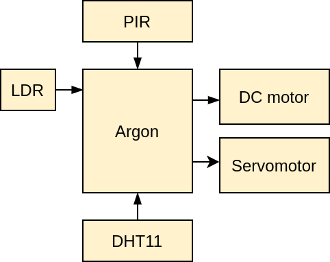
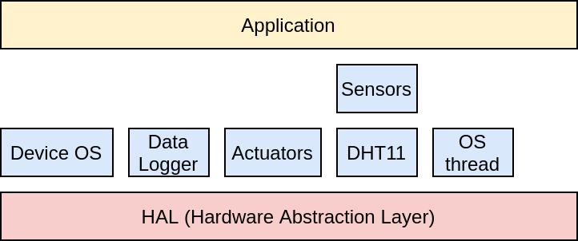
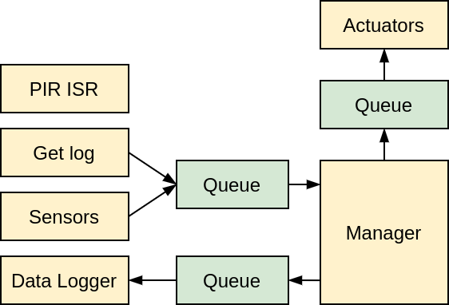
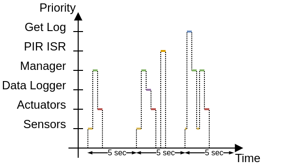

# UCB_DIT-520
Proyecto final para la materia Sistemas Embebidos

## Diagrama en bloques

El siguiente diagrama muestra la interconexión de los componentes físicos del sistema.

El componente principal es la tarjeta de desarrollo Particle Argon, encargada de gestionar la comuniación con todos los sensores y actuadores conectados. Los sensores utilizados son el DHT11 (temperatura y humedad relativa), sensor PIR (movimiento) y un LDR (intensidad de luz). Los actuadores son un motor DC convencional de baja corriente y un servomotor.

Los actuadores son accionados en función de los valores obtenidos de los sensores. De esta manera se tiene un sistema reactivo a las variables del ambiente donde se encuentra el sistema.

## Diagrama de capas

El siguiente diagrama muestra la jerarquía de los componentes de software del programa.

La capa más baja (HAL) está compuesta por las librerías propias del entorno de Particle y sirve como abstracción del hardware. La capa superior contiene todos los componentes que necesita la aplicación para realizar las funciones de obtención de los valores de los sensores, accionamiento de los actuadores, almacenamiento de datosm, RTOS y funciones Cloud de Particle. Finalmente, la capa de nivel superior se sirve de las capas de niveles inferiores para realizar las funciones principales del sistema.

## Diagrama RTOS

El siguiente diagrama muestra la comunicación de las tareas dentro del programa.

Para la comunicación e intercambio de datos entre las tareas se implementaron colas de mensajes. La tarea principal es Manager, que se encarga de procesar las muestras de los sensores, generar el log de datos almacenados, publicar en el cloud enviar los valores de los sensores a la tarea de actuadores y la tarea de almacenamiento de datos. Existe también una tarea que no tiene ningún tipo de comunicación y es PIR ISR, que es manejada por interrupciones a través el cambio de estado de un pin.

El siguiente diagrama muestra el comportamiento de las tareas antes mencionadas.

La tarea Sensors es periódica (5 sec) y cuando concluye envía los datos que obtiene a Manager que los gestiona para notificar a Actuators y Data Logger que deben realizar sus funciones con los datos recibidos. Get Log es una función asincrónica que eventualmente notificará a Manager que debe imprimir en pantalla el log de datos almacenado. PIR ISR también es asincrónica pero no se comunica con las tareas existentes,.

## Video

En el siguiente link se encuentra el video de demostración.

[Demo](https://drive.google.com/file/d/1Mo-o1vsFNYbLALE-En-i6_e1KND5OXVm/view?usp=sharing)
